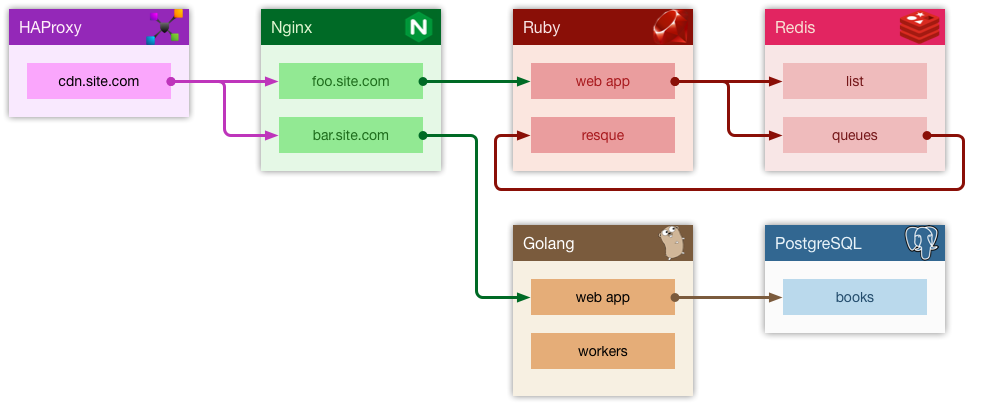

# Architecture Diagram

Include a single core diagram of the product. Detail the product's components, endpoints, request flows, dependencies (upstream and downstream), and data stores (databases or caches).

The architecture diagram is a visual representation that summarizes the complexity of the product. It helps developers reason about adding new features and identify potential issues or points of failure.

#### Example

