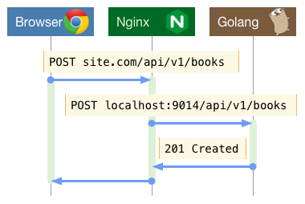

# Endpoints, Flows, and Dependencies

Explain all endpoints, requests flows, and dependencies for a true understanding of the product.

### Endpoints

Endpoints are the public interface of the product. They should be described well enough that another developer can treat the product as a black box. A list of each endpoint with request and response payloads is sufficient.

> **API Tooling**
>
> API tools like [Swagger](https://swagger.io/) and [Apiary](https://apiary.io/) may provide endpoint documentation that meets the production ready requirements. Providing a link to the documentation is usually works well enough, but you may want to embed a copy of the documentation here to keep everything in one place and provide an offline copy.

### Request Flows

Request flows diagram the how requests are handled and flow through the product. A sufficiently detailed architecture diagram may include this information, if so this section may be removed.

#### Example

### Dependencies

List any dependencies the product relies on, like third-party services. Or in a microservice environment, other upstream or downstream microservices. It's important to not only list the dependencies, but to document any the dependencies' SLAs and alternatives, backups, or caches to be used in case of failure. Link to the dependencies' documentation or any dashboards or status feeds.
